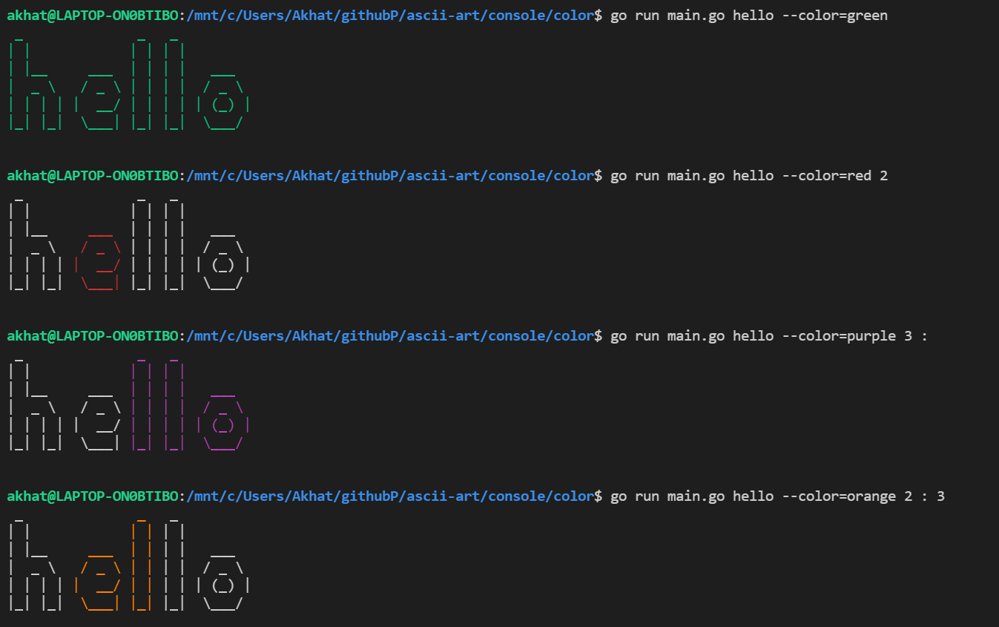

## Description
The output should manipulate colors using the flag --color=<color>, in which --color is the flag and <color> is the color desired by the user.

You can choose between coloring a single letter or a set of letters.
If the letter is not specified, the whole string can be colored.
The flag has exactly the same format as above, any other formats returns the following usage message:

    Usage: go run . [STRING] [OPTION]
    
    EX: go run . something --color=<color>

## Usage
 
    
